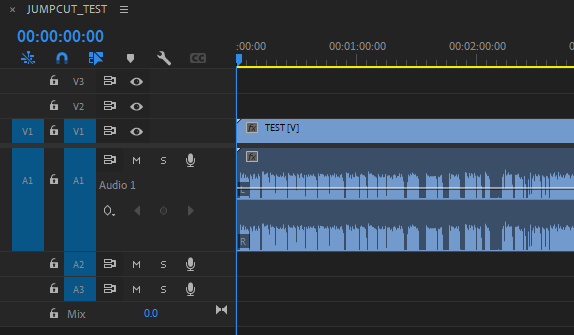
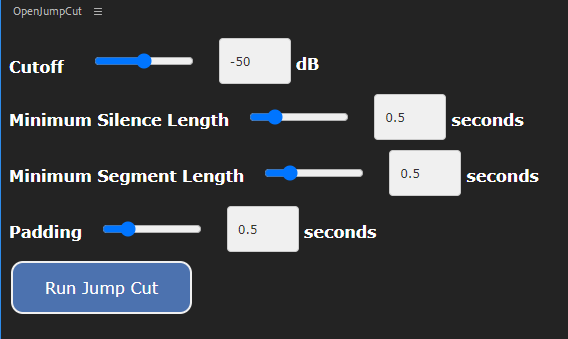

# OpenJumpCuts
A free, open-source jump cut extension for Adobe Premiere Pro.

Currently in **alpha**. Expect bugs. Make copies of your work.

## About
I made this extension based on my experience editing lengthy, repetitive educational materials in Adobe Premiere. 'Jump cut' refers to the tedious task of removing silence and mistakes from podcasts, interviews, etc. While there are several extensions for jump cuts that exist already, none of them are free and open-source.

The extension works by analyzing the audio waveform of a given clip and removing areas below a certain loudness threshold. The loudness threshold, padding, and minimum silence lengths are all configurable from the extension GUI in Premiere.

### CEP and UXP
Adobe is working on phasing out CEP extensions in favor of UXP extensions. This is a CEP plugin, and so will eventually need to be ported to UXP. As of December, 2023,  Premiere does not yet support UXP.

### A note on Premiere AI tools
As of November of 2023, the Premiere AI tools are still in beta. They are promising as a potential replacement for waveform-based jump cut automation, but they are still not at the point where I find them usable in my own workflow.

## Installation
The extension is not currently available on Adobe's distribution platforms, so it must be installed manually.

Clone the repository into your Adobe CEP extensions folder. \
On Windows: `C:\Program Files (x86)\Common Files\Adobe\CEP\extensions`\

The Premiere API does not expose data on audio waveforms, so
the extension relies on an external executable (compiled from `jumpcut.py` via `pyinstaller`) to perform jumpcut calculations. This executable in turn relies on [ffmpeg](https://ffmpeg.org/download.html) to read different codecs. `ffmpeg` must be accessible on your system's PATH.

Due to issues with `ffmpeg`, MacOS is currently unsupported.

It is also worth noting that this executable must have permission to read the original media source files that are referenced in Premiere.

Since the extension is not currently signed, it must be run in [debug mode](https://github.com/Adobe-CEP/Samples/tree/master/PProPanel). See section 2: "Loading of Unsigned Panels".

## Manual
#### Prerequisites
Currently, there are strict limitations on the configuration of clips and timelines that will work. 

Only the currently active sequence is analyzed. 
Nested sequences on the timeline are not supported. Only clips in tracks Video 1 and Audio 1 are analyzed. Video and audio clips must be linked. Position and cropping of the clip in the timeline does not matter.  

To avoid undefined behavior, the extension currently will not run unless there is a single linked pair of video/audio clips on the timeline. If you need to jump cut only a portion of a timeline, or wish to jump cut content in an already crowded timeline, the current workflow is to save clips one at a time as nested sequences, and run jump cuts from within those nested sequences.

Future development goals include more flexibility regarding these constraints, including logic for handling multiple clips and multiple tracks.

#### Options

There are four jump cut parameters currently supported.

**Cutoff:**
This is the value below which a clip is considered silent. Due to difficulties with conversion, for now it likely will not be reflective of the actual dB values shown in Premiere.

**Minimum Silence Length:**
If a silent portion of a clip is shorter than this value, it will be ignored.

**Minimum Segment Length:**
If a non-silent portion of a clip is shorter than this value, it will be considered silent.

**Padding:**
Adds a buffer of silence around areas where sliences have been removed.

### Known issues
- If your whole clip is being deleted, it is likely that the silence threshold has been set such that the entire clip is considered silent. Try adjusting the threshold slider lower.

- Cutoff dB values may not reflect Premiere dB values.

## Bug Reports and Contributing
If you have a fix or a feature you'd like to add, please open a pull request! Report any bugs in Issues.
